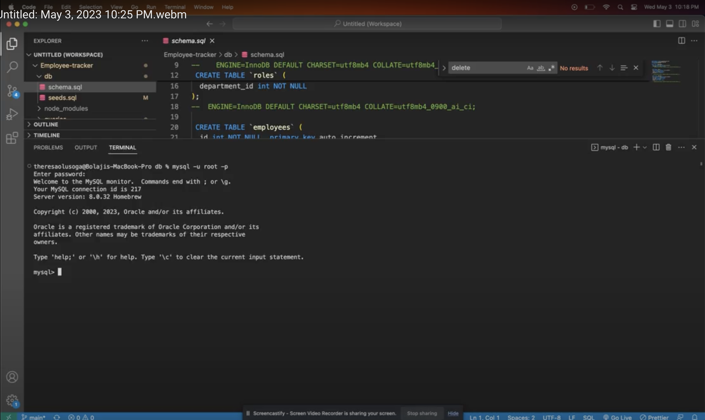
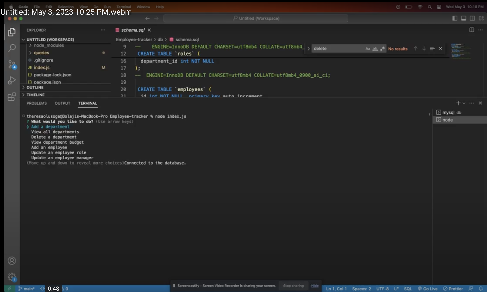
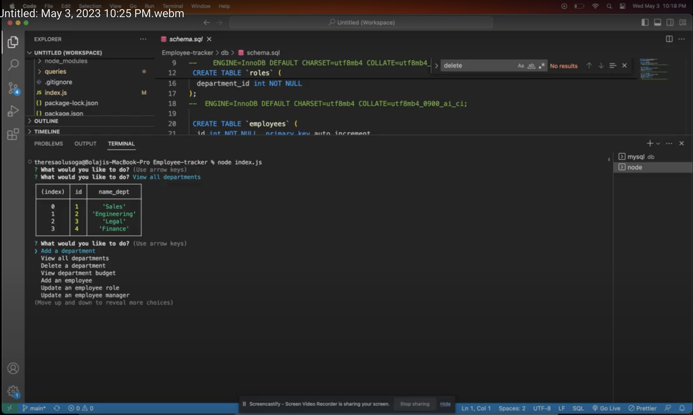
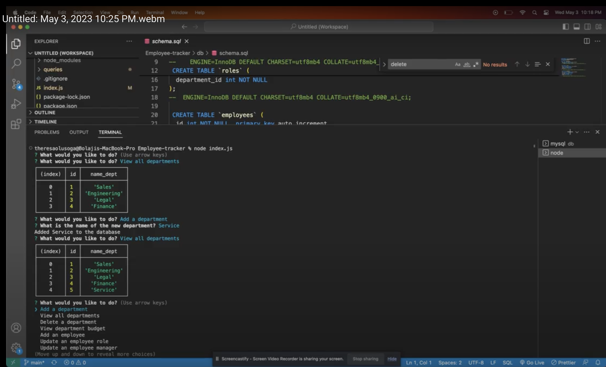
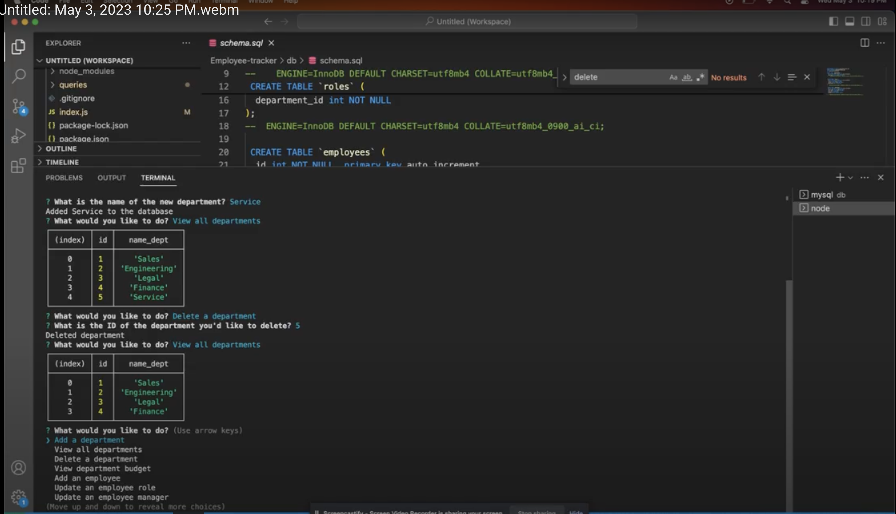
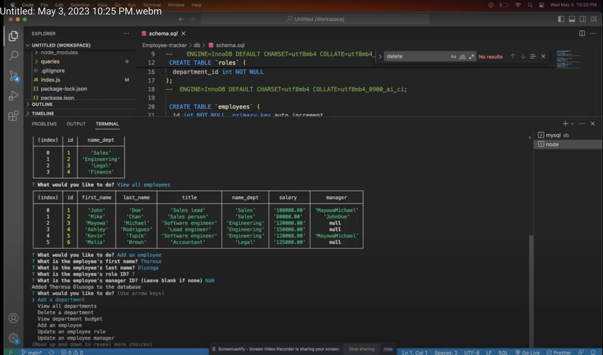
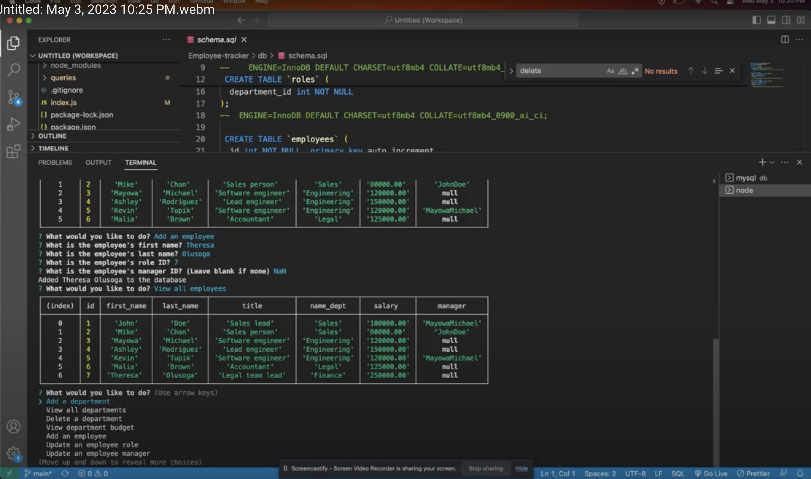
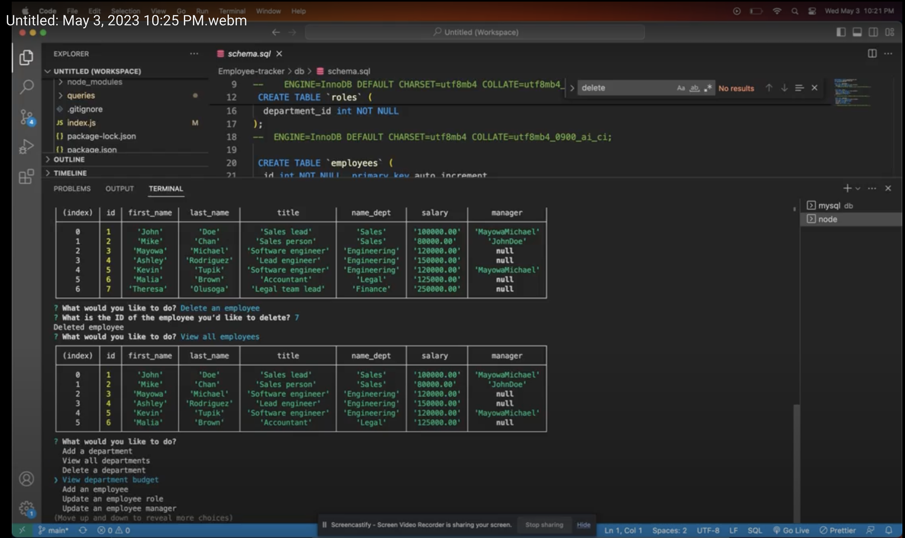
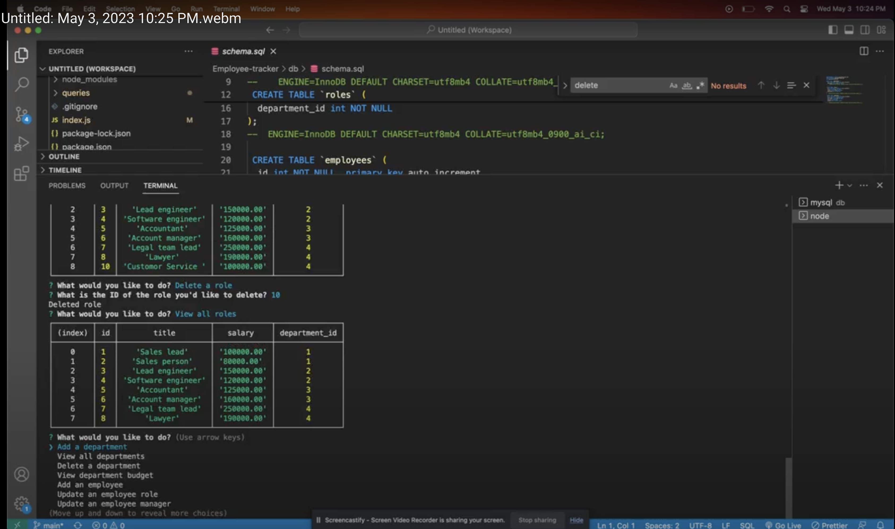

# Project Name - Employee-tracker

# Project URL

https://github.com/TessyJ/Note-Taker

# Project Repository

https://tessyj.github.io/Note-Taker/

# Walkthrough Video

https://short-note-taker.herokuapp.com/

# Project Description

This Employee Tracker could view and manage my company's departments, roles, and employees.
The walkthrough video was able to demonstrate viewing, adding and deleting both departments, roles and employees to the table.

# Screen Shot

